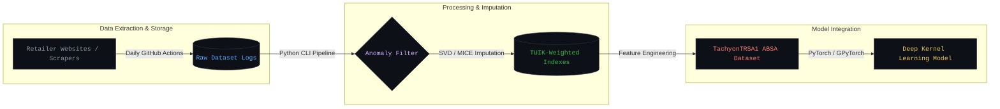

# Hi there 👋

## 🌌 I'm Arhan 

  
  
  

An **Artificial Intelligence & Data Engineering** undergraduate student at Özyeğin University specializing in Aspect-Based Sentiment Analysis (ABSA), robust ETL automation pipelines, and agentic workflows.

---

### ⚡ Technical Blueprint

---

### 🛠️ Technology Stack & Armament

  <!-- Languages -->
  
  
  
  <!-- Data Engineering & DevOps -->
  
  
  
  <!-- AI / ML Frameworks -->
  
  
  
  

---

### 📂 Featured Projects & Research

#### 1. 🧠 Aspect-Based Sentiment Analysis (ABSA) Framework
* **Description:** Developed an ABSA semi-supervised annotation framework and published a human-annotated Turkish dataset (`TachyonTRSA1`) on Hugging Face to evaluate multi-class aspects.
* **Core:** Designed custom evaluation pipelines and training log visualizations using regular expression parsers and matplotlib for diagnostic tracking.

#### 2. 📊 inflationstudymirror
* **Description:** Built a production-grade automated pipeline managing real-time price scrapers for 10+ major retail chains, run daily via GitHub Actions.
* **Core:** Developed a local Python CLI executing SVD/MICE data imputation, median-based outlier filtering, and pricing indexation weighted against official TUIK indicators.

#### 3. 🛡️ ALZHAI (TEKNOFEST Health AI App)
* **Description:** Co-developed a healthcare solution for the TEKNOFEST Artificial Intelligence in Health Competition under an agile Scrum framework.
* **Core:** Structured and normalized raw telemetry data with Pandas, while designing high-fidelity mobile wireframe flows in Balsamiq.

#### 4. 📈 Deep Kernel Learning (DKL) Optimization
* **Description:** Constructed and evaluated Gaussian Process (GP) regression models within a PyTorch and GPyTorch-backed DKL structure.
* **Core:** Implemented robust token-distribution diagnostic plots, customized loss visualizations, and numerical bounds handling for text-related optimization.

---
# 📊 GitHub Stats:

